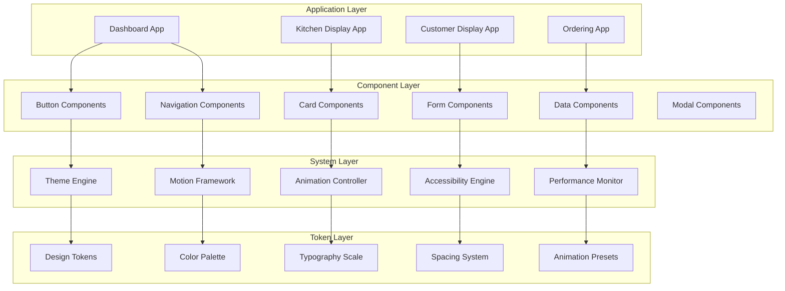
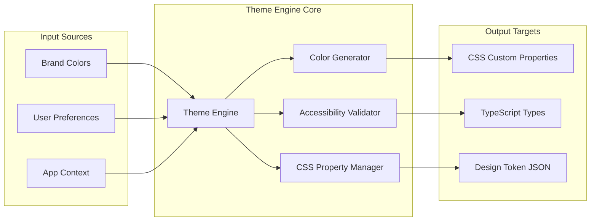
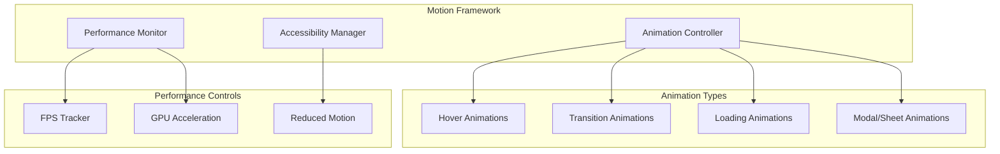

# Forest & Cream Design System Implementation Design

## Overview

The Forest & Cream Design System Implementation establishes a comprehensive visual identity framework for the BalPOS restaurant operating system across all four frontend applications (dashboard, kitchen-display, customer-display, ordering). This design leverages the Forest Enterprise aesthetic with sophisticated motion design, ensuring professional appearance and delightful user experiences while maintaining high performance and accessibility standards.

The system introduces a modern, cohesive design language centered around Forest Green (#1A3A32) and Warm Cream (#FAF9F5) colors, coupled with the premium Geist typography and smooth animation framework. The design emphasizes consistency, performance, and accessibility while providing application-specific optimizations for different user contexts.

Key design principles:

- **Consistency**: Unified visual language across all applications
- **Performance**: Hardware-accelerated animations maintaining 60fps
- **Accessibility**: WCAG AA compliance with reduced motion support
- **Flexibility**: Dynamic theming with brand customization capabilities
- **Developer Experience**: Comprehensive component library with TypeScript support

## Architecture

The Forest & Cream Design System follows a layered architecture with clear separation of concerns:



### Theme Engine Architecture

The Theme Engine provides dynamic theming capabilities with automatic color generation and accessibility validation:



### Motion Framework Architecture

The Motion Framework manages all animations with performance monitoring and accessibility compliance:



## Components and Interfaces

### Core Design System Components

#### ThemeProvider Interface

```typescript
interface ThemeProvider {
    theme: DesignTheme;
    setTheme: (theme: Partial<DesignTheme>) => void;
    generatePalette: (primaryColor: string) => ColorPalette;
    validateContrast: (foreground: string, background: string) => boolean;
    applyTheme: () => void;
}

interface DesignTheme {
    colors: {
        primary: string; // Forest Green #1A3A32
        surface: string; // Warm Cream #FAF9F5
        accent: string; // Generated from primary
        neutral: ColorScale; // Generated neutral scale
    };
    typography: TypographyScale;
    spacing: SpacingScale;
    animation: AnimationPresets;
    accessibility: AccessibilitySettings;
}
```

#### Component Library Interfaces

```typescript
// Button Component System
interface ButtonProps {
    variant: "primary" | "secondary" | "tertiary";
    size: "small" | "medium" | "large";
    state: "default" | "hover" | "active" | "disabled" | "loading";
    animation?: boolean;
    children: React.ReactNode;
}

// Card Component System
interface CardProps {
    elevation: "none" | "small" | "medium" | "large";
    interactive?: boolean;
    padding: SpacingToken;
    children: React.ReactNode;
}

// Navigation Component System
interface NavigationProps {
    items: NavigationItem[];
    orientation: "horizontal" | "vertical";
    activeIndicator: boolean;
    collapseBreakpoint?: number;
}

interface NavigationItem {
    id: string;
    label: string;
    icon?: IconComponent;
    href?: string;
    active?: boolean;
    disabled?: boolean;
}
```

#### Animation System Interfaces

```typescript
interface AnimationController {
    createTransition: (config: TransitionConfig) => Animation;
    respectReducedMotion: () => boolean;
    monitorPerformance: () => PerformanceMetrics;
    cancelAnimation: (id: string) => void;
}

interface TransitionConfig {
    duration: number;
    easing: EasingFunction;
    properties: CSSProperty[];
    delay?: number;
    fillMode?: "forwards" | "backwards" | "both" | "none";
}

interface PerformanceMetrics {
    averageFPS: number;
    droppedFrames: number;
    animationCount: number;
    memoryUsage: number;
}
```

### Application-Specific Component Extensions

#### Dashboard Components

```typescript
interface DashboardCardProps extends CardProps {
    chartType?: "line" | "bar" | "pie" | "metric";
    dataVisualization?: boolean;
    refreshable?: boolean;
}

interface DataTableProps {
    columns: ColumnDefinition[];
    data: TableRow[];
    sortable: boolean;
    filterable: boolean;
    pagination?: PaginationConfig;
    loading?: boolean;
}
```

#### Kitchen Display Components

```typescript
interface OrderCardProps extends CardProps {
    order: OrderData;
    status: "pending" | "preparing" | "ready" | "completed";
    priority: "low" | "medium" | "high" | "urgent";
    estimatedTime?: number;
    statusAnimation?: boolean;
}

interface KitchenDisplayProps {
    orders: OrderData[];
    layout: "grid" | "list" | "kanban";
    autoRefresh: boolean;
    soundEnabled: boolean;
}
```

#### Customer Display Components

```typescript
interface CustomerDisplayProps {
    mode: "queue" | "promotional" | "menu";
    ambientMode?: boolean;
    brandingVisible?: boolean;
    contentRotation?: boolean;
}

interface QueueDisplayProps {
    currentQueue: QueueItem[];
    callingAnimation?: boolean;
    estimatedWait?: number;
}
```

#### Ordering Application Components

```typescript
interface ProductCardProps extends CardProps {
    product: ProductData;
    imageOptimization?: boolean;
    addToCartAnimation?: boolean;
    touchOptimized?: boolean;
}

interface MobileCartProps {
    items: CartItem[];
    total: number;
    drawerStyle?: boolean;
    checkoutAnimation?: boolean;
}
```

## Data Models

### Design Token Model

```typescript
interface DesignTokens {
    colors: {
        brand: {
            forest: "#1A3A32";
            cream: "#FAF9F5";
            accent: string; // Generated
        };
        semantic: {
            success: string;
            warning: string;
            error: string;
            info: string;
        };
        neutral: {
            50: string;
            100: string;
            200: string;
            300: string;
            400: string;
            500: string;
            600: string;
            700: string;
            800: string;
            900: string;
        };
        text: {
            primary: string; // 87% opacity
            secondary: string; // 60% opacity
            disabled: string; // 38% opacity
        };
    };

    typography: {
        fontFamily: "Geist";
        scale: {
            display: {
                fontSize: "32px";
                fontWeight: 600;
                lineHeight: 1.2;
            };
            heading: {
                fontSize: "24px";
                fontWeight: 600;
                lineHeight: 1.2;
            };
            subheading: {
                fontSize: "20px";
                fontWeight: 500;
                lineHeight: 1.2;
            };
            body: {
                fontSize: "16px";
                fontWeight: 400;
                lineHeight: 1.5;
            };
            caption: {
                fontSize: "14px";
                fontWeight: 400;
                lineHeight: 1.4;
            };
            small: {
                fontSize: "12px";
                fontWeight: 400;
                lineHeight: 1.4;
            };
        };
    };

    spacing: {
        base: 4; // Base unit in px
        scale: [4, 8, 12, 16, 24, 32, 48, 64];
    };

    borderRadius: {
        small: "4px";
        medium: "8px"; // Round Eight
        large: "12px";
        full: "50%";
    };

    animation: {
        duration: {
            fast: "150ms"; // Hover states
            medium: "200ms"; // Page transitions
            slow: "250ms"; // Modals/drawers
            loading: "1500ms"; // Loading animations
        };
        easing: {
            easeOut: "cubic-bezier(0.0, 0.0, 0.2, 1)";
            easeIn: "cubic-bezier(0.4, 0.0, 1, 1)";
            easeInOut: "cubic-bezier(0.4, 0.0, 0.2, 1)";
            bounce: "cubic-bezier(0.68, -0.55, 0.265, 1.55)";
        };
    };
}
```

### Component State Model

```typescript
interface ComponentState {
    variant: string;
    size: "small" | "medium" | "large";
    state:
        | "default"
        | "hover"
        | "active"
        | "focus"
        | "disabled"
        | "loading"
        | "error"
        | "success";
    animation: {
        enabled: boolean;
        duration: number;
        easing: string;
        properties: string[];
    };
    accessibility: {
        ariaLabel?: string;
        ariaDescribedBy?: string;
        tabIndex?: number;
        role?: string;
    };
}
```

### Theme Configuration Model

```typescript
interface ThemeConfiguration {
    id: string;
    name: string;
    colors: {
        primary: string;
        surface: string;
        customOverrides?: Record<string, string>;
    };
    preferences: {
        reducedMotion: boolean;
        highContrast: boolean;
        fontSize: "small" | "medium" | "large";
    };
    application: {
        dashboard?: ApplicationThemeOverrides;
        kitchenDisplay?: ApplicationThemeOverrides;
        customerDisplay?: ApplicationThemeOverrides;
        ordering?: ApplicationThemeOverrides;
    };
}

interface ApplicationThemeOverrides {
    colors?: Partial<ColorPalette>;
    typography?: Partial<TypographyScale>;
    spacing?: Partial<SpacingScale>;
    components?: ComponentOverrides;
}
```

### Performance Monitoring Model

```typescript
interface PerformanceData {
    timestamp: number;
    metrics: {
        fps: number;
        animationCount: number;
        memoryUsage: number;
        renderTime: number;
        droppedFrames: number;
    };
    context: {
        application: string;
        component: string;
        userAgent: string;
        deviceType: "mobile" | "tablet" | "desktop";
    };
    optimizations: {
        hardwareAcceleration: boolean;
        reducedMotion: boolean;
        performanceMode: boolean;
    };
}
```

## Error Handling

### Theme Engine Error Handling

The Theme Engine implements robust error handling to ensure graceful degradation when theme operations fail:

**Color Generation Failures**

- When color generation fails, fallback to default Forest Enterprise palette
- Log color generation errors with context for debugging
- Validate all generated colors for accessibility compliance
- Provide user feedback when custom colors fail contrast requirements

**CSS Property Application Errors**

- Catch CSS custom property application failures
- Fallback to hardcoded design token values
- Log CSS errors with browser compatibility context
- Gracefully handle unsupported CSS features in older browsers

**Theme Persistence Errors**

- Handle localStorage quota exceeded scenarios
- Implement theme preference fallback chain: localStorage → sessionStorage → defaults
- Log persistence errors without affecting user experience
- Provide theme reset functionality for corrupted preferences

### Animation System Error Handling

The Animation Controller provides comprehensive error handling for motion-related failures:

**Performance Degradation Handling**

- Monitor FPS and automatically reduce animation complexity when performance drops below 45fps
- Implement animation priority system to preserve critical animations
- Fallback to simplified transitions when GPU acceleration is unavailable
- Log performance metrics for optimization analysis

**Animation Timing Errors**

- Handle animation completion timeout scenarios (default 5s timeout)
- Cancel stuck animations and cleanup DOM state
- Provide animation retry mechanisms for critical transitions
- Log animation timing issues with component context

**Reduced Motion Compliance**

- Detect prefers-reduced-motion system setting changes
- Immediately disable all motion when accessibility requirements change
- Provide instant state changes as alternatives to animated transitions
- Log accessibility preference changes for analytics

### Component Library Error Handling

Component error boundaries and graceful degradation strategies:

**Component Rendering Errors**

- Implement error boundaries for all high-level components
- Provide fallback UI components when primary components fail
- Log component errors with props and state context
- Maintain application functionality when individual components crash

**Prop Validation Errors**

- Validate component props in development mode with detailed error messages
- Provide default props for required properties when validation fails
- Log prop validation errors with component usage context
- Guide developers with helpful error messages and documentation links

**State Management Errors**

- Handle component state corruption scenarios
- Implement state reset mechanisms for recoverable errors
- Log state management errors with component lifecycle context
- Provide debug utilities for component state inspection

### Application-Specific Error Handling

**Dashboard Application Errors**

- Handle data visualization rendering failures with placeholder content
- Implement chart error boundaries with retry mechanisms
- Provide fallback table views when chart rendering fails
- Log data visualization errors with dataset context

**Kitchen Display Errors**

- Handle order data corruption with error highlighting
- Implement order state recovery mechanisms
- Provide manual refresh capabilities when auto-refresh fails
- Log kitchen display errors with critical priority

**Customer Display Errors**

- Handle promotional content loading failures gracefully
- Implement content fallback systems for network issues
- Provide basic queue display when enhanced features fail
- Log customer-facing errors with minimal user impact

**Ordering Application Errors**

- Handle product image loading failures with placeholder images
- Implement cart state persistence across crashes
- Provide offline mode capabilities for order preparation
- Log ordering errors with order recovery information

### Error Reporting and Analytics

**Error Logging Strategy**

- Implement structured logging with consistent error formats
- Include error context: user agent, device type, application state
- Log performance metrics alongside errors for correlation analysis
- Provide error reproduction information for debugging

**Error Recovery Mechanisms**

- Implement automatic retry logic for transient failures
- Provide manual recovery options for persistent errors
- Include error recovery guidance in user interfaces
- Track error recovery success rates for system improvement

## Testing Strategy

The Forest & Cream Design System requires comprehensive testing across multiple dimensions to ensure reliability, performance, and accessibility compliance.

### Visual Regression Testing

**Component Snapshot Testing**

- Implement comprehensive Storybook stories for all components across different states
- Automated visual regression testing using Chromatic or Percy
- Cross-browser screenshot comparison for Chrome, Firefox, Safari, and Edge
- Responsive design validation across mobile, tablet, and desktop breakpoints
- Theme variation testing to ensure consistency across different brand configurations

**Design Token Validation**

- Automated testing of design token generation and application
- CSS custom property validation across browser environments
- Color contrast ratio automated testing for accessibility compliance
- Typography rendering consistency testing across operating systems

### Integration Testing

**Theme Engine Integration**

- End-to-end testing of theme switching and persistence
- Cross-application theme consistency validation
- Performance testing of theme application and CSS variable updates
- Browser compatibility testing for CSS custom property support

**Animation System Integration**

- Animation performance testing across device capabilities
- Reduced motion preference detection and compliance testing
- Animation timing and completion validation
- GPU acceleration effectiveness testing

**Component Library Integration**

- Component interaction testing across all applications
- Cross-application component consistency validation
- Component state management testing with various prop combinations
- Accessibility integration testing with screen readers

### Performance Testing

**Animation Performance Benchmarking**

- FPS monitoring during complex animation sequences
- Memory usage tracking during animation-heavy interactions
- Battery usage impact testing on mobile devices
- Animation optimization effectiveness validation

**Component Rendering Performance**

- Component mount and unmount timing benchmarks
- Re-render optimization validation with prop changes
- Bundle size impact measurement for component library changes
- Tree-shaking effectiveness testing for unused components

**Theme Engine Performance**

- CSS custom property application performance testing
- Color generation algorithm performance benchmarking
- Theme switching latency measurement
- Memory usage tracking for theme management

### Unit Testing

**Component Behavior Testing**

- Individual component functionality testing with Jest and React Testing Library
- Component prop validation and error handling testing
- Component accessibility attribute testing
- Component keyboard navigation and focus management testing

**Theme Engine Unit Testing**

- Color generation algorithm testing with various input colors
- Accessibility validation function testing with edge cases
- CSS property generation testing with malformed inputs
- Theme preference persistence testing with storage limitations

**Animation Controller Unit Testing**

- Animation timing function testing with various configurations
- Performance monitoring function testing with simulated conditions
- Reduced motion detection testing with mocked system preferences
- Animation cleanup and memory management testing

### Accessibility Testing

**WCAG Compliance Testing**

- Automated accessibility testing using axe-core in all component tests
- Color contrast ratio validation for all color combinations
- Keyboard navigation testing for all interactive components
- Screen reader compatibility testing with NVDA, JAWS, and VoiceOver

**Reduced Motion Testing**

- prefers-reduced-motion system setting compliance testing
- Animation disable functionality testing
- Alternative feedback mechanism testing when animations are disabled
- User preference override testing for animation controls

### Cross-Application Testing

**Consistency Validation**

- Automated testing to ensure identical component behavior across applications
- Design token application consistency testing
- Navigation pattern consistency validation
- Form validation and error messaging consistency testing

**Application-Specific Feature Testing**

- Dashboard-specific data visualization component testing
- Kitchen display order management component testing
- Customer display ambient mode functionality testing
- Ordering application mobile optimization testing

### Testing Infrastructure

**Automated Testing Pipeline**

- Pre-commit hooks for basic component and accessibility testing
- Continuous integration pipeline with comprehensive test suite
- Automated browser testing across multiple environments
- Performance regression detection with baseline comparison

**Development Testing Tools**

- Storybook integration with comprehensive component documentation
- Design token debugging tools for development environment
- Animation performance profiling tools
- Accessibility testing integration in development workflow

**Testing Documentation and Standards**

- Comprehensive testing guidelines for new component development
- Performance benchmark standards for animation and rendering
- Accessibility testing checklists for component development
- Cross-browser compatibility testing standards

This multi-layered testing approach ensures the Forest & Cream Design System maintains high quality, performance, and accessibility standards while providing confidence in system reliability across all four BalPOS applications.
